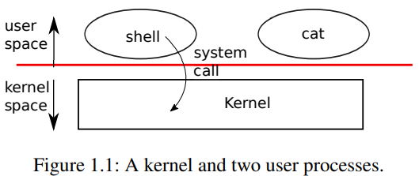

## chapter 1 Operating system interfaces

#### xv6

### 1.1 Processes and memory

- a **kernel** & many **processes**
  - kernel - a special program that provides services to running programs
  - process - has memory containing instructions, data, and a stack

- **system call** - a process invokes a kernel service



- time-shares processes


system call example:

- A process may create a new process using the **fork** system call

- **exit** causes the calling process to stop executing and to release resources such as memory and open files

- **wait** returns the PID of an exited (or killed) child of the current process and copies the exit status of the child to the address passed to wait

  ```c
  int pid = fork();
  if(pid > 0){
  	printf("parent: child=%d\n", pid);
  	pid = wait((int *) 0);
  	printf("child %d is done\n", pid);
  } else if(pid == 0){
  	printf("child: exiting\n");
  	exit(0);
  } else {
  	printf("fork error\n");
  }
  ```

- **exec** replaces the calling process’s memory with a new memory image loaded from a file stored in the file system

  - 2 params: the name of the file containing the executable and an array of string arguments

  ```c
  char *argv[3];
  argv[0] = "echo";
  argv[1] = "hello";
  argv[2] = 0;
  exec("/bin/echo", argv);
  printf("exec error\n");
  ```

- shell - implementation

### 1.2 I/O and File descriptors

##### file discriptor features

1. a **small integer** representing a kernel-managed object that a process may read from or write to
2. the file descriptor interface abstracts away the differences between files, pipes, and devices, making them all look like **streams of bytes**.
3. **an index into a per-process table**, every process has a private space of file descriptors starting at zero (0: standard input; 1: standard output; 2: standard error)

system call example:

- **read、write**
- **close**
- **dup** - duplicates an existing file descriptor, returning a new one that refers to the same underlying I/O object. Both file descriptors share an offset, just as the file descriptors duplicated by fork do.

##### cat

```c
// 1. system call write() & read() implement cat
char buf[512];
int n;
for(;;) {
	n = read(0, buf, sizeof(buf));
    if (n == 0) break;
    if (n < 0) {
        fprintf(2, "read error\n");
        exit(1);
	}
    if (write(1, buf, n) != n) {
        fprintf(2, "write error\n");
        exit(1);
	}
}
```

##### I/O redirection 

```c
// 2. File descriptors and fork() implement I/O redirection
// redirect
pid = fork();
if (pid == 0) {        // child
    close(1);          // releases file descriptors 1
    // file descriptors 1 allocates to redirect.txt
    open("redirect.txt", O_WRONLY|O_CREATE);  

    char* argv[] = {"echo", "this", "is", "redirect", "echo", 0};
    exec("echo", argv);          // exec preserves file descriptors
    fprintf(2, "redirect failed\n");
    exit(1);
} else {
    wait(&status);
}
```

### 1.3 pipe

##### **pipe features**

- ##### A pipe is a small kernel buffer exposed to processes as a pair of file descriptors, one for reading and one for writing

- 没看懂：P16-p17

```c
// pipetest.c
int p[2];
char *argv[2];
argv[0] = "wc";
argv[1] = 0;
pipe(p);
if (fork() == 0) {
    close(0);
    dup(p[0]);    // make file descriptor zero refer to the read end of the pipe
    close(p[0]);
    close(p[1]);
    exec("wc", argv);
} else {
    close(p[0]);
    write(p[1], "hello world\n", 12);
    close(p[1]);
}
```

