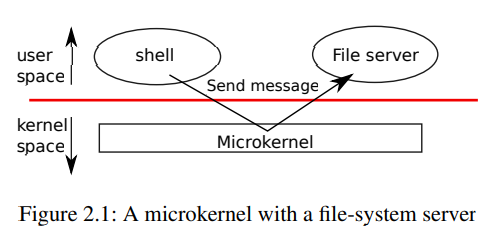
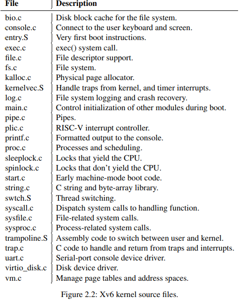
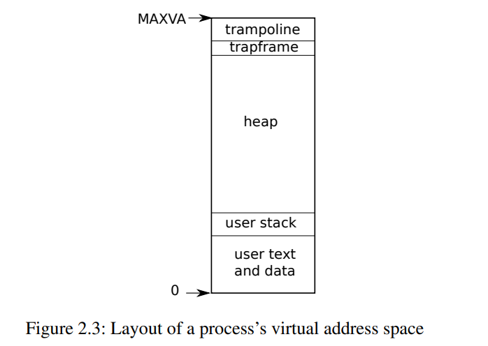
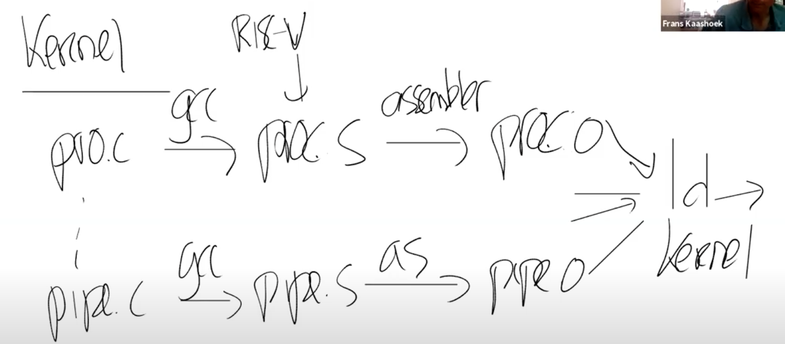
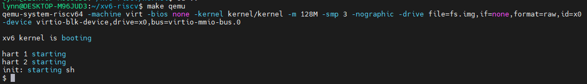
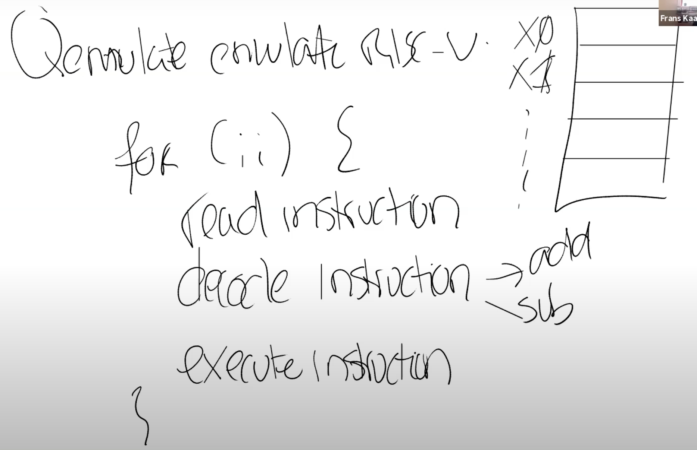
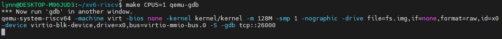
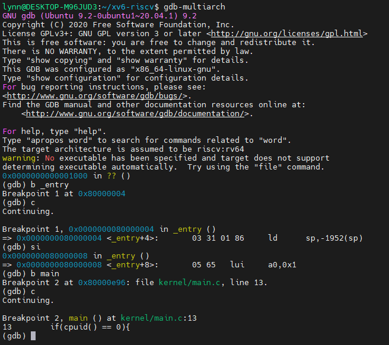
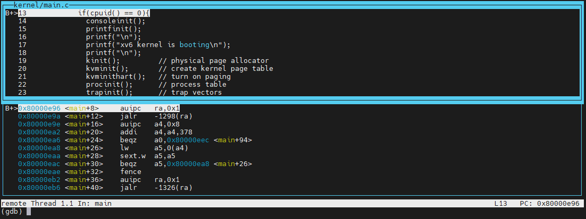

# chapter 2 Operating system organization

- ##### multiplexing（多任务）

- ##### isolation

- ##### interaction

### # xv6 

- Xv6 runs on a multi-core1 RISC-V microprocessor, and much of its low-level functionality (for example, its process implementation) is specific to RISC-V.
  - RISC-V is a 64-bit CPU, and xv6 is written in “LP64” C.

## 2.1 Abstracting physical resources

strong isolation - forbid applications from directly accessing sensitive hardware resources, and instead to **abstract the resources into services**.

1. ###### Unix applications interact with storage only through the file system’s open, read, write, and close system calls, instead of reading and writing the disk directly.

2. ###### Unix processes use exec to build up their memory image, instead of directly interacting with physical memory.

3. ###### Unix transparently switches hardware CPUs among processes, saving and restoring register state as necessary, so that applications don’t have to be aware of time sharing.

## 2.2 User mode, supervisor mode, and system calls

Strong isolation requires a **hard boundary between applications and the operating system.**

1. If the application makes a mistake, we don’t want the operating system to fail or other applications to fail.
2. Instead, the operating system should be able to clean up the failed application and continue running other applications.

- CPUs provide hardware support for strong isolation
  - RISC-V has three modes in which the CPU can execute instructions:
    - machine mode
    - supervisor mode
    - user mode
  - CPUs provide a special instruction that switches the CPU from user mode to supervisor mode and enters the kernel at an entry point specified by the kernel. (RISC-V provides the **ecall** instruction for this purpose.)

## 2.3 Kernel organization

- what part of the operating system should run in supervisor mode?

  

1. **monolithic kernel（宏内核）** - the entire operating system resides in the kernel
   - 优点：
     - convenient - the OS designer doesn’t have to decide which part of the operating system doesn’t need full hardware privilege.
     - easy for different parts of the os to cooperate
   - 缺点：
     - interfaces between different parts of the os are complex

2. **microkernel（微内核）** - To reduce the risk of mistakes in the kernel, OS designers can minimize the amount of os code that runs in supervisor mode, and execute the bulk of the os in user mode.
   - The kernel interface consists of a few low-level functions for starting applications, sending messages, accessing device hardware, etc. This organization allows the kernel to be relatively simple, as most of the operating system resides in user-level servers.



> Figure 2.1 illustrates this microkernel design. In the figure, the file system runs as a user-level process. OS services running as processes are called servers. To allow applications to interact with the file server, the kernel provides an inter-process communication mechanism to send messages from one user-mode process to another. For example, if an application like the shell wants to read or write a file, it sends a message to the file server and waits for a response. 


Xv6 is implemented as a monolithic kernel, like most Unix operating systems. Thus, the xv6 kernel interface corresponds to the operating system interface, and the kernel implements the complete operating system.

## 2.4 Code: xv6 organization

The xv6 kernel source: kernel/



The inter-module interfaces are defined in defs.h (kernel/defs.h)

## 2.5 Process overview

- **Isolation** - The **process** abstraction prevents:

  - one process from wrecking or spying on another process’s memory, CPU, file descriptors, etc.

  - a process from wrecking the kernel itself, so that a process can’t subvert the kernel’s isolation mechanisms

- The mechanisms used by the kernel to implement processes include (prevent circumventing isolation):

  - user/supervisor mode flag
  - address spaces
  - time-slicing of threads

- illusion - A process provides a program with what appears to be a private memory system, or address space, which other processes cannot read or write and its own CPU to execute the program’s instructions.

  - process’s **address space**

    - maximum address

    

- Per-process state - `struct proc` (kernel/proc.h)

  - p->state: indicates whether the process is allocated, ready to run, running, waiting for I/O, or exiting.

  - p->pagetable: holds the process’s page table. xv6 causes the paging hardware to use a process’s 

    p->pagetable when executing that process in user space.

- **thread** - executes the process’s instructions

  - can be suspended and later resumed
  - 2 stacks:
    - user stack
    - kernel stack


- ecall & sret

## 2.6 Code: starting xv6 and the first process

1. When the RISC-V computer powers on, it initializes itself and run a **boot loader** (stored in ROM), and boot loader loads the xv6 kernel into memory at physical address **0x80000000**

   - the address range 0x0:0x80000000 contains I/O devices

2. In machine mode, the CPU executes xv6 starting at **_entry** (kernel/entry.S:6)

   ```assembly
   _entry:
   	    # set up a stack for C so that xv6 can run C code
           # stack0 is declared in start.c,
           # with a 4096-byte stack per CPU.
           # sp = stack0 + (hartid * 4096)
           la sp, stack0
           li a0, 1024*4
   		csrr a1, mhartid
           addi a1, a1, 1
           mul a0, a0, a1
           add sp, sp, a0
   	# jump to start() in start.c
           call start
   ```

   - loads the stack pointer register sp with the address stack0+4096, the top of the stack, because the stack on RISC-V grows down.
   - calls into C code at start (kernel/start.c:21)

3. The function **start** performs some configuration that is only allowed in machine mode, and then switches to supervisor mode.

   1. set the previous privilege mode to supervisor in the register *mstatus*
   2. set the return address to main by writing main’s address into the register *mepc*
   3. disable virtual address translation in supervisor mode by writing 0 into the page-table register *satp*
   4. delegate all interrupts and exceptions to supervisor mode
   5. programs the clock chip to generate timer interrupts

4. **main** (kernel/main.c:11) initializes several devices and subsystems.

5. create the first user process by calling **userinit** (kernel/proc.c:212)

   - The first process executes a small program written in RISC-V assembly, **initcode.S** (user/initcode.S:1), which re-enters the kernel by invoking the exec system call.

   - initcode完成了通过exec系统调用调用init程序（initcode - Glue Code）

     ```assembly
     start:
             la a0, init
             la a1, argv
             li a7, SYS_exec
             ecall
     ```

   - returns to user space in the /init process. 

6. **Init** (user/init.c:15) ：配置好console，调用fork，并在fork出的子进程中执行shell.


## # 编译运行kernel

1. Makefile读取C文件，例如proc.c；调用gcc编译器，生成一个文件叫做proc.s，这是RISC-V 汇编语言文件；之后再走到汇编解释器，生成proc.o，这是汇编语言的二进制格式。
2. Loader将所有.o文件链接在一起，生成Kernel；这里生成的内核文件就是在QEMU中运行的文件，Makefile还会创建kernel.asm，这里包含了内核的完整汇编语言，你们可以通过查看它来定位究竟是哪个指令导致了Bug




3. 调用qemu运行Kernel
   - -kernel：这里传递的是内核文件（kernel目录下的kernel文件），这是将在QEMU中运行的程序文件。
   - -m：这里传递的是RISC-V虚拟机将会使用的内存数量
   - -smp：这里传递的是虚拟机可以使用的CPU核数
   - -drive：传递的是虚拟机使用的磁盘驱动，这里传入的是fs.img文件




## # QEMU

QEMU仿真RISC-V处理器，背后的含义？

在内部，在QEMU的主循环中，只在做一件事情：

- 读取4字节或者8字节的RISC-V指令。
- 解析RISC-V指令，并找出对应的操作码（op code）。我们之前在看kernel.asm的时候，看过一些操作码的二进制版本。通过解析，或许可以知道这是一个ADD指令，或者是一个SUB指令。
- 之后，在软件中执行相应的指令。

这基本上就是QEMU的全部工作了，对于每个CPU核，QEMU都会运行这么一个循环。

为了完成这里的工作，QEMU的主循环需要维护寄存器的状态。所以QEMU会有以C语言声明的类似于X0，X1寄存器等等。



## # **[XV6 启动过程-gdb内核调试](https://mit-public-courses-cn-translatio.gitbook.io/mit6-s081/lec03-os-organization-and-system-calls/3.9-xv6-qi-dong-guo-cheng)**

1. 修改`.gdbinit`

修改 `home` 目录下的 `.gdbinit` 文件，允许 `gdb` 在`xv6-riscv`这个目录启动的时候，加载该文件夹下的 `.gdbinit` 文件:

```bash
echo "add-auto-load-safe-path /home/lynn/xv6-riscv/.gdbinit " >> ~/.gdbinit
```

若允许加载任何目录的`.gdbinit`：

```bash
echo "set auto-load safe-path / " >> ~/.gdbinit
```

2. 启动QEMU gdb server:

```bash
make CPUS=1 qemu-gdb
```



3. 另开一个窗口，启动一个gdb client:

```bash
lynn@DESKTOP-M96JUD3:~/xv6-riscv$ gdb-multiarch
```

- **给user代码打断点** 简单来说，就是以下几步：

1. `file user/_ls`
2. `b main`
3. `c`
4. 之后就是正常的`GDB` 使用流程了

- **调试内核**



```bash
(gdb)layout split
```

从这个视图可以看出gdb要执行的下一条指令是什么，断点具体在什么位置:


