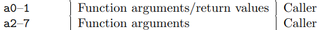
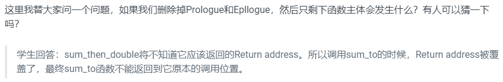

# Calling Convention

**LEC 5 (TAs):** [GDB, calling conventions and stack frames RISC-V](https://pdos.csail.mit.edu/6.828/2021/lec/gdb_slides.pdf) (2020: [notes](https://pdos.csail.mit.edu/6.828/2021/lec/l-riscv.txt), [boards](https://pdos.csail.mit.edu/6.828/2021/lec/l-riscv-slides.pdf), [video](https://youtu.be/s-Z5t_yTyTM))
**Preparation**: Read [Calling Convention](https://pdos.csail.mit.edu/6.828/2021/readings/riscv-calling.pdf)
**Assignment**: [Lab pgtbl: Page tables](https://pdos.csail.mit.edu/6.828/2021/labs/pgtbl.html)

## C程序到汇编程序的转换

- 任何一个处理器都有一个关联的ISA（Instruction Sets Architecture），每个指令都有对应的二进制编码或者一个Opcode。当处理器运行时，看到这些编码就知道该做什么操作。

## RISC-V vs. X86

- 不同处理器对应的汇编语言不同
  - RISC-V汇编
- RISC & CISC应用
  - RISC-V处理器（嵌入式设备）、ARM处理器（安卓、Apple）：**精简指令集（RISC）**
  - 大部分PC处理器为x86（Intel、AMD）：**复杂指令集（CISC）**

- RISC vs. CISC
  - 指令的数量（RISC有更少的指令数量）2-8原则
  - RISC指令更简单，趋于完成更简单的工作
  - RISC是唯一一款开源指令集（任何人都可以为RISC-V开发主板）

## gdb和汇编代码执行

- global表示你可以在其他文件中调用这个函数。text表明这里的是代码

## RISC-V寄存器

- RISC-V寄存器

  - 所有寄存器都是64bit；各种数据类型都会被改造放进这64bit中。
    - 比如一个32bit整数，取决于是否有符号，会在前面补32个0或1存在寄存器中。
  - 寄存器是位于CPU上的，预先定义的可以用来存储数据的位置。
  - 汇编代码并不是在内存中运行，而是在寄存器中运行。
  - 使用寄存器的方法：

  

  - 寄存器是用来进行任何运算和数据读取的最快的方式（为啥使用寄存器rather than内存）

- a0到a7寄存器是用来作为函数的参数。如果一个函数有超过8个参数，我们就需要用内存了
  - 当可以使用寄存器的时候，我们不会使用内存，我们只在不得不使用内存的场景才使用它。

- Saved
  - **Caller** Saved寄存器在函数调用的时候不会保存
    - 一个Caller Saved寄存器可能被其他函数重写。假设我们在函数a中调用函数b，任何被函数a使用的并且是Caller Saved寄存器，调用函数b可能重写这些寄存器。例子: Return address寄存器（注，保存的是函数返回的地址），ra寄存器是Caller Saved，这一点很重要，它导致了当函数a调用函数b的时侯，b会重写Return address。
  - **Callee** Saved寄存器在函数调用的时候会保存

## Stack + Calling Convention

栈：使函数有组织，并且能正常返回

- 每个区域为一个Stack Frame，每执行一次函数调用就会产生一个Stack Frame。

  - 函数通过移动Stack Pointer来完成Stack Frame的空间分配。

- Stack是从高地址向低地址使用，所有栈总是向下增长。

  - 创建Stack Frame时，对当前Stack Pointer做减法。

- Stack Frame

  - Stack Frame包含：
    - 保存的寄存器
    - 本地变量
    - 当函数参数多于8个时，额外的参数会出现在Stack中
  - 同的函数有不同数量的本地变量，不同的寄存器，所以Stack Frame的大小是不一样的。但是有关Stack Frame有两件事情是确定的：
    - **Return address**总是会出现在Stack Frame的第一位
    - **指向前一个Stack Frame的指针**也会出现在栈中的固定位置（当前函数返回时，将此存到FP寄存器中）

  - Stack Frame中的两个重要寄存器
    - Stack Pointer：指向Satck底部，代表了当前Stack Frame的位置
    - Frame Pointer：指向当前Stack Frame的顶部
      - 可通过FP得到Return address & 指向前一个Stack Frame的指针

- Stack Frame必须要被汇编代码创建，所以是编译器生成了汇编代码，进而创建了Stack Frame。汇编函数结构：

  

- 汇编函数结构例子：
  1. prologue：Stack Pointer减16，为新的Stack Frame分配16B空间；将Return address保存在Stack Pointer位置
  2. body：调用sum_to并对结果乘以2
  3. Epllogue：将Return address加载回ra寄存器，通过对Stack Pointer加16来删除刚刚创建的Stack Frame，最后ret从函数中退出

[其他看视频]

## Struct Layout in memory

- struct在内存中是一段连续的地址
- 可以认为struct像是一个数组，但是里面的不同字段的类型可以不一样