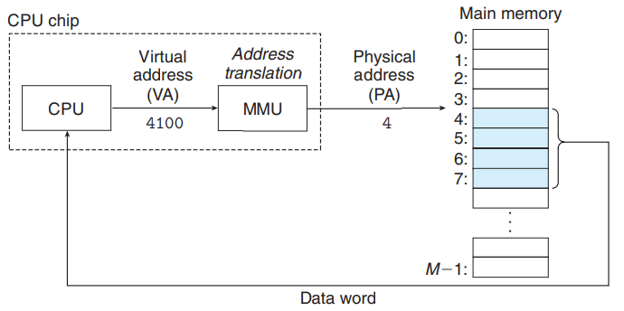
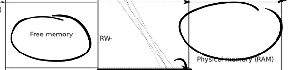

# chapter 3 Page tables

**LEC 4 (ab):** [Page tables](https://pdos.csail.mit.edu/6.828/2021/slides/6s081-lec-vm.pdf) (2020: [notes](https://pdos.csail.mit.edu/6.828/2021/lec/l-vm.txt), [boards](https://pdos.csail.mit.edu/6.828/2021/lec/l-vm-boards.pdf), [video](https://youtu.be/f1Hpjty3TT8))
**Preparation**: Read [Chapter 3](https://pdos.csail.mit.edu/6.828/2021/xv6/book-riscv-rev2.pdf) and [kernel/memlayout.h](https://github.com/mit-pdos/xv6-riscv/blob/riscv/kernel/memlayout.h), [kernel/vm.c](https://github.com/mit-pdos/xv6-riscv/blob/riscv/kernel/vm.c), [kernel/kalloc.c](https://github.com/mit-pdos/xv6-riscv/blob/riscv/kernel/kalloc.c), [kernel/riscv.h](https://github.com/mit-pdos/xv6-riscv/blob/riscv/kernel/riscv.h), and [kernel/exec.c](https://github.com/mit-pdos/xv6-riscv/blob/riscv/kernel/exec.c)

**LEC 5 (TAs):** [GDB, calling conventions and stack frames RISC-V](https://pdos.csail.mit.edu/6.828/2021/lec/gdb_slides.pdf) (2020: [notes](https://pdos.csail.mit.edu/6.828/2021/lec/l-riscv.txt), [boards](https://pdos.csail.mit.edu/6.828/2021/lec/l-riscv-slides.pdf), [video](https://youtu.be/s-Z5t_yTyTM))
**Preparation**: Read [Calling Convention](https://pdos.csail.mit.edu/6.828/2021/readings/riscv-calling.pdf)
**Assignment**: [Lab pgtbl: Page tables](https://pdos.csail.mit.edu/6.828/2021/labs/pgtbl.html)


## Virtual memory

> 详见csapp

- 内存的隔离性

- 为每个进程提供了一个大的、一致的和私有的地址空间

### 1- 虚拟内存作为缓存的工具

### 2- 虚拟内存作为内存管理的工具

### 3- 虚拟内存作为内存保护的工具


## Address Space

- 地址空间是一个非负整数地址的有序集合
- 每个程序都运行在自己的地址空间，并且这些地址空间相互独立
  - 强隔离性


## Page Table

- 如何在一个物理内存上创建不同的地址空间？页表

使用虚拟内存寻址的系统：



- 内存管理单元 (MMU) 利用内存中的**页表**来进行地址翻译
  - 寄存器**satp**存放页表物理地址
  - 每个进程都有自己独立的页表

### RISC-V中如何进行虚拟内存寻址？

#### #1 分页

- 地址翻译以Page为单位

  - 不是为每个地址创建一个页表条目，而是**为每个页创建一个页表条目**（分页）

  - 页大小为4KB


- VA有效位39bit，分为两部分：Index (查找Page) & Offset (Page中的哪个字节，位数对应页大小)

- 物理内存地址是56bit（物理内存可以>=<单个虚拟内存地址空间），44bit是物理页号PPN（Physical Page Number），剩下12bit直接拷贝过来

- 地址翻译时，VA-27bit Index -> PA-44bit PPN，12bit Offset直接拷贝

#### #2 多级页表

- 现在每个进程的页表大小为2^27，过多的占用物理内存

- 多级页表优点：若地址空间中大部分地址都没使用，不必为每个Index准备一个条目

  - 举个栗子，一个进程地址空间只使用了一个Page，需要多少Page Directory和PTE呢？

    3；3*512（比起单级页表2^27少占用很多内存空间）


1. VA中的27bit Index被分成L2 L1 L0各9bit，用来索引Page Directory
2. 一个Page Directory大小为4096bit，一个页那么大
3. Page Directory一个条目被称为PTE（Page Table Entry），64bit（和一个寄存器大小一样），共512个PTE
4. satp寄存器指向最高级Page Directory的物理地址

- **PTE中的Flag**


> 三级页表的查找发生在硬件中（MMU），然而在xv6中函数`walk`也实现了页表查找功能。
>
> 

- **页表提供了一层抽象（a level of indirection）**

  - 这里的抽象就是指虚拟地址到物理地址的映射，这里的映射关系由os控制

    

  > 因为操作系统对于这里的地址翻译有完全的控制，它可以实现各种各样的功能。比如，当一个PTE是无效的，硬件会返回一个page fault，对于这个page fault，操作系统可以更新 page table并再次尝试指令。所以，通过操纵page table，在运行时有各种各样可以做的事情。

## Translation Lookaside Buffer (TLB)

- 对于一个虚拟内存的寻址，需要访问3次内存，代价高

- 解决：对最近使用过的虚拟地址翻译结果缓存，这个缓存为TLB（页表缓存），就是PTE的缓存
  - cache of PTE: [VA, PA]
  - 切换页表 -> flush TLB (指令为sfence_vma)

## Kernel Page Table


### 物理地址空间

- 完全由硬件设计者决定。
- 当完成地址翻译后，若得到的物理地址大于0x80000000会走向DRAM芯片，如果得到的物理地址低于0x80000000会走向不同的I/O设备。

- 其他的I/O设备，通过内存映射I/O（Memory-mapped I/O）的地址执行指令

  - PLIC是中断控制器（Platform-Level Interrupt Controller）

  - CLINT（Core Local Interruptor）也是中断的一部分。所以多个设备都能产生中断，需要中断控制器来将这些中断路由到合适的处理函数。

  - UART0（Universal Asynchronous Receiver/Transmitter）负责与Console和显示器交互。

  - VIRTIO disk，与磁盘进行交互。

### 内核地址空间

- xv6为每个进程保存一张页表，用来描述每个进程的**用户地址空间**；另外用一张单独的页表来描述**内核地址空间**。
- 当机器刚刚启动时，还没有可用的page，XV6 os会设置好**内核使用的虚拟地址空间**，也就是这张图左边的地址分布。
  - The kernel configures the layout of its address space to give itself access to physical memory and various hardware resources at predictable virtual addresses.

#### 1- 大部分为直接映射

虚拟地址到物理地址的映射，大部分为直接映射（相等的关系）

- 比如说内核会按照这种方式设置page table，虚拟地址0x02000000对应物理地址0x02000000。这意味着左侧低于PHYSTOP的虚拟地址，与右侧使用的物理地址是一样的。
- 直接映射会简化内核代码读写物理内存
  - For example, when fork allocates user memory for the child process, the allocator returns the physical address of that memory; fork uses that address directly as a virtual address when it is copying the parent’s user memory to the child

#### 2- 非直接映射

1. 有一些page在虚拟内存中的地址很靠后，如kernel stack

   - kernel下面有未被映射的Guard page（PTE_V未设置，且不会映射到任何物理内存）；若kernel stack溢出到Guard page会触发page fault

   - 这样Kernel stack被映射了两次，实际是用的上面的那部分，因为更安全
   - 可以利用页表做的有趣的事情：**向同一个物理地址映射两个虚拟地址**

2. The trampoline page
   - 被映射到虚拟地址空间的最上侧；用户页表有相同的映射

- 权限

  - trampoline & kernel text 权限：PTE_R PTE_X
    - 内核从这两中页中读取并执行指令

  - 其他页权限：PTE_R PTE_W
    - 可以读写这些页的内存

Q&A:





> 用户进程的虚拟地址空间是由内核设置好的，专属于进程的page table来完成地址翻译

### Code: creating a kernel address space

#### [`kvminit`](https://github.com/mit-pdos/xv6-riscv/blob/riscv//kernel/vm.c#L22) - 创建内核页表

1. 为最高级page directory分配物理页

   ```c
   kpgtbl = (pagetable_t) kalloc();
   memset(kpgtbl, 0, PGSIZE);
   ```

2.  通过函数`kvmmap`（install translations），将每个I/O设备映射到内核地址空间

   - The file (kernel/memlayout.h) declares the constants for xv6’s kernel memory layout.
   - 将物理地址映射到相同的内核虚拟地址（直接映射）

   ```c
   // uart registers
   kvmmap(kpgtbl, UART0, UART0, PGSIZE, PTE_R | PTE_W);
   // virtio mmio disk interface
   kvmmap(kpgtbl, VIRTIO0, VIRTIO0, PGSIZE, PTE_R | PTE_W);
   // PLIC
   kvmmap(kpgtbl, PLIC, PLIC, 0x400000, PTE_R | PTE_W);
   // map kernel text executable and read-only.
   kvmmap(kpgtbl, KERNBASE, KERNBASE, (uint64)etext-KERNBASE, PTE_R | PTE_X);
   // map kernel data and the physical RAM we'll make use of.
   kvmmap(kpgtbl, (uint64)etext, (uint64)etext, PHYSTOP-(uint64)etext, PTE_R | PTE_W);
   // map the trampoline for trap entry/exit to
   // the highest virtual address in the kernel.
   kvmmap(kpgtbl, TRAMPOLINE, (uint64)trampoline, PGSIZE, PTE_R | PTE_X);
   ```

   


