# chapter 4 Traps and system calls

## 4.1 Trap机制

Trap: 用户态 -> 内核态的转换；发生在以下三种情况下：

- system call
- fault (page fault、运算时除以0等)
- interrupt

trap涉及了许多小心的设计和重要的细节，对于实现**安全隔离 & 性能**方面非常重要（trap要设计的尽量简单）

在用户态 -> 内核态的转换过程中，**硬件的状态**非常重要（将硬件从适合运行用户应用程序的状态，改变到适合运行内核代码的状态）

- 32个用户寄存器
  - pc程序计数器（Program Counter Register）
  - privilege mode - supervisor mode or user mode
  - 一些控制CPU工作方式的寄存器：如SATP
  - STVEC（Supervisor Trap Vector Base Address Register）寄存器 - 指向了内核中处理trap的指令的起始地址
  - SEPC（Supervisor Exception Program Counter）寄存器 - 在trap的过程中保存程序计数器的值
  - SSRATCH（Supervisor Scratch Register）寄存器

这些寄存器表明了执行系统调用时计算机的状态。


### 用户态 -> 内核态的转换过程中发生了什么？

在trap的最开始，CPU的所有状态都设置成运行用户代码而不是内核代码。在trap处理的过程中，需要更改一些状态，或者对状态做一些操作。这样才可以运行系统内核中普通的C程序。

1. **保存32个用户寄存器 & pc**
   - 之后需要恢复用户应用程序的执行，尤其是当用户程序随机的被设备中断所打断时。我们希望内核能够响应中断，之后在用户程序完全**无感知**的情况下再恢复用户代码的执行。所以这意味着32个用户寄存器不能被内核弄乱。但是这些寄存器又要被内核代码所使用，所以在trap之前，你必须先在某处保存这32个用户寄存器。
   - 程序计数器也需要在某个地方保存，它几乎跟一个用户寄存器的地位是一样的，我们需要能够在用户程序运行中断的位置继续执行用户程序。

2. **转换为supervisor mode**

   - 需要使用内核中的各种各样的特权指令
   - supervisor mode可以做但user mode不能做的事：读写控制寄存器（SATP STVEC SEPC SSCRATCH）；可以使用PTE_U标志位为0的PTE

   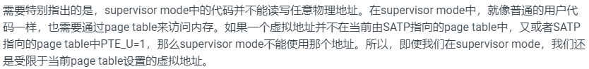

3. **SATP设为内核页表**

4. **Stack Pointer指向Kernel Stack**

   - 需要一个堆栈来调用内核的C函数

5. **跳转到内核C代码**

high-level goals:

1. 安全 & 隔离
   - 不让用户代码介入到user/kernel切换，否则有可能会破坏安全性。这意味着，trap中涉及到的硬件和内核机制不依赖任何来自用户空间东西。
2. trap机制对用户代码是**透明**的

## 4.2 Trap代码执行流程

### 整体流程

**跟踪Shell中调用write系统调用**

1. write会通过执行**ECALL指令**来执行系统调用，ECALL指令会切换到具有supervisor mode的内核中。
2. 内核执行的第一个代码是**uservec**汇编代码（trampoline.s）
3. 然后跳转到c函数**usertrap**中（trap.c）
4. 在usertrap中执行**syscall**函数，根据传入的系统调用号查找对应的系统调用函数**sys_write**
5. **sys_write**将要显示数据输出到console上，完成后返回**syscall**函数
6. syscall函数调用**usertrapret**，此函数完成了部分方便在c代码中实现的返回到用户空间的工作（trap.c）
7. 还有一些返回到用户空间的工作只能在汇编代码中完成，实现在**userret**函数中
8. 最后，在这个汇编函数中会调用机器指令返回到用户空间，并且恢复ECALL之后的用户程序的执行

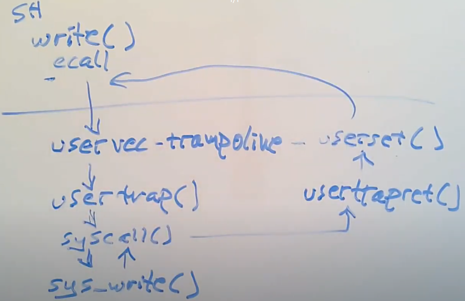

### gdb代码跟踪

**gdb跟踪一个xv6系统调用：Shell将提示信息通过write系统调用走到os再输出到console的过程**

#### **ECALL指令之前的状态**

1. 作为用户代码的Shell调用write时，实际上调用的是关联到Shell的一个库函数**write** - 被调用的write函数实现（usys.s）

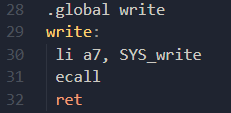

2. sh.c中getcmd()调用了fprintf，write系统调用封装在fprintf里面；查看sh.asm可以找到write中ECALL指令的地址为0xdec。

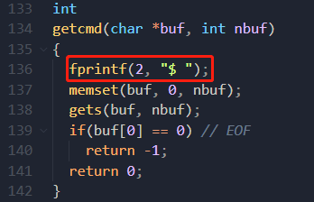

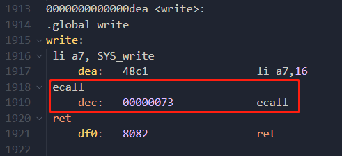

3. 开始gdb调试

   ```bash
   make CPUS=1 qemu-gdb
   ```

   ```bash
   gdb-multiarch
   ```

   在0xdec处设置断点，程序停在ecall处。

   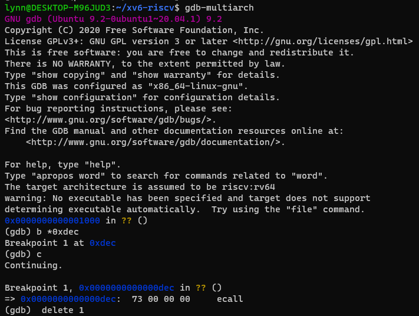

   查看32个寄存器，其中a0 a1为传入系统调用write的参数。可以看到sp和pc的值都很小，表示在用户地址空间。

   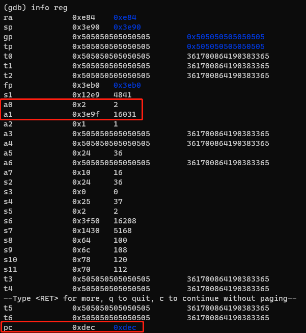

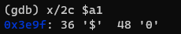

系统调用的时间点会有大量状态的变更，其中一个最重要的需要变更的状态，并且在它变更之前我们对它还有依赖的，就是是当前的page table，查看SATP寄存器，这里输出的是物理内存地址。

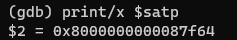

在QEMU中有一个方法可以打印当前的page table。从QEMU界面，输入*ctrl a + c*可以进入到QEMU的console，之后输入*info mem*，QEMU会打印完整的page table。

这是用户程序shell的page table，这6条映射关系是有关Shell的指令和数据，以及一个无效的page用来作为guard page（PTE_U未设置），以防止Shell尝试使用过多的stack page。

最后两条PTE的虚拟地址非常大，非常接近虚拟地址的顶端，这两个page分别是trapframe page和trampoline page，它们都没有设置u标志，所以用户代码不能访问这两条PTE。一旦我们进入到了supervisor mode，我们就可以访问这两条PTE了。

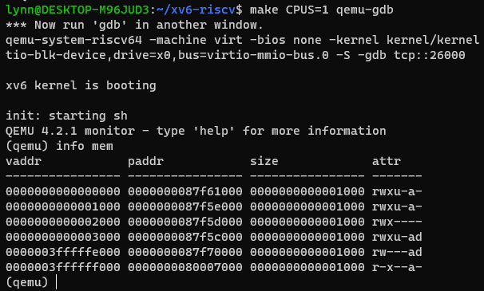

在Shell中打印出write函数的内容，pc现在指向ecall指令，目前还处于用户空间，马上进入内核空间。

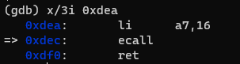

#### ECALL指令之后的状态

**ECALL做了3件事：**

- **将代码从user mode改到supervisor mode**
- **将pc的值保存在SEPC寄存器中**
- **跳转到STVEC寄存器指向的指令**

stepi无法进入ECALL内核空间（可能跟gdb版本有关）；

> 代替方法：查看STVEC寄存器，手动在这里打断点（ECALL跳转到此地址），此时进入内核模式，pc值为0x3ffffff000（trampoline页首地址）。

现在正在trampoline page执行代码，trampoline page包含了内核的trap处理代码。

ecall指令重要特点 - 并不会切换page table。这意味着，trap处理代码必须存在于每一个user page table中，而这个就是trampoline page，是由内核小心的映射到每一个user page table中，以使得当我们仍然在使用user page table时，内核在一个地方能够执行trap机制的最开始的一些指令。并没有设置PTE_U来保证trap机制的安全性（只有在supervisor mode才能执行trampoline中的指令）。

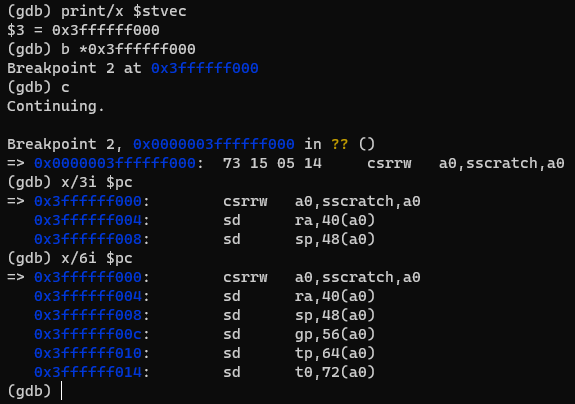

此时SEPC寄存器的值保存了之前pc的值

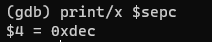

查看page table，与ECALL指令执行之前是完全相同的，page table没有改变。

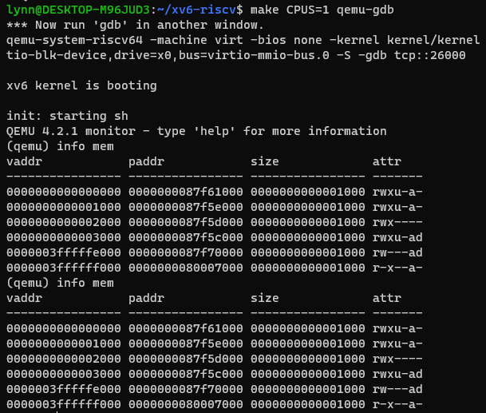

查看此时32个寄存器的值没有变化，还是用户程序拥有的一些寄存器内容（在将寄存器数据保存在某处之前，我们在这个时间点不能使用任何寄存器，否则的话我们是没法恢复寄存器数据的）。

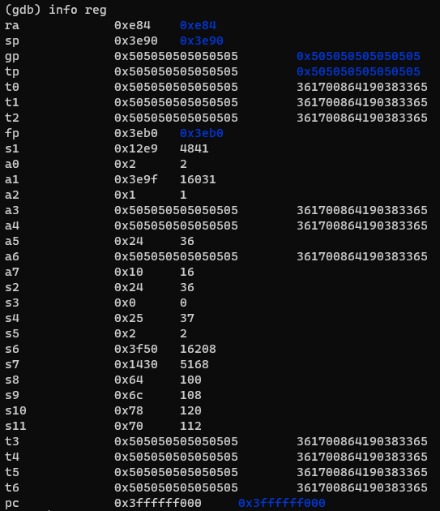

**现在，ecall帮我们做了3件事，但是实际上离执行内核中的C代码还差的很远，接下来需要：**

- **保存32个用户寄存器的内容**
- **切换到kernel page table**
- **创建或者找到一个kernel stack，并将sp寄存器指向此kernel stack。**
- **跳转到内核中C代码的某些合理的位置**

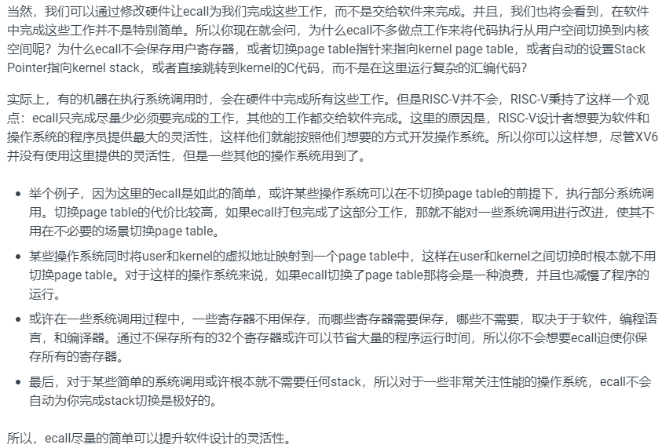

#### uservec函数（trampoline.S）

1. **保存32个用户寄存器**

SSCRATCH寄存器保存了trapframe-usertrap (user-trap-handler)的地址

交换a0、sscratch，此时a0中保存了trapframe-0x3fffffe000，sscratch保存了系统调用第一个参数

```assembly
csrrw a0, sscratch, a0
```

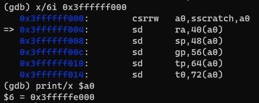

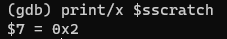

32个用户寄存器保存到该进程的trapframe page中（struct trapframe - proc.h）

注意前5个空槽不是用来保存32个用户寄存器的。

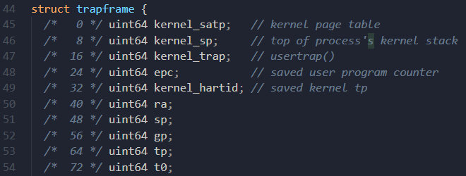				

sd命令依次保存32个用户寄存器

```assembly
# save the user registers in TRAPFRAME
        sd ra, 40(a0)
        sd sp, 48(a0)
        sd gp, 56(a0)
        sd tp, 64(a0)
        sd t0, 72(a0)
        sd t1, 80(a0)
        sd t2, 88(a0)
        sd s0, 96(a0)
        sd s1, 104(a0)
        sd a1, 120(a0)
        sd a2, 128(a0)
        ......
```

2. **内核将预先存入trapframe的前5个值加载到对应寄存器**

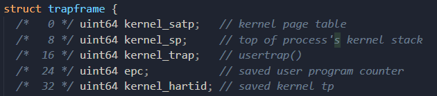

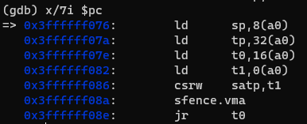

设置sp寄存器

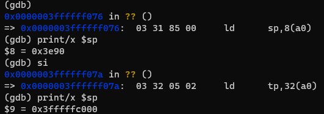

设置tp寄存器（XV6会将CPU核的编号也就是hartid保存在tp寄存器）

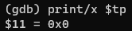

a0存有将要执行的第一个C函数（usertrap）的指针，将其写入t0寄存器

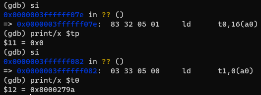

向satp寄存器写入kernel page table地址

```assembly
# restore kernel page table from p->trapframe->kernel_satp
	ld t1, 0(a0)
	csrw satp, t1
	sfence.vma zero, zero
```

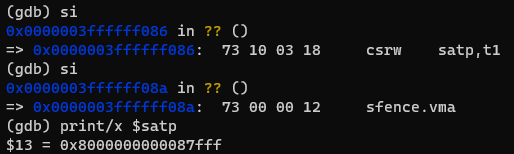

QEMU中打印page table，可以看出与之前的page table完全不一样。

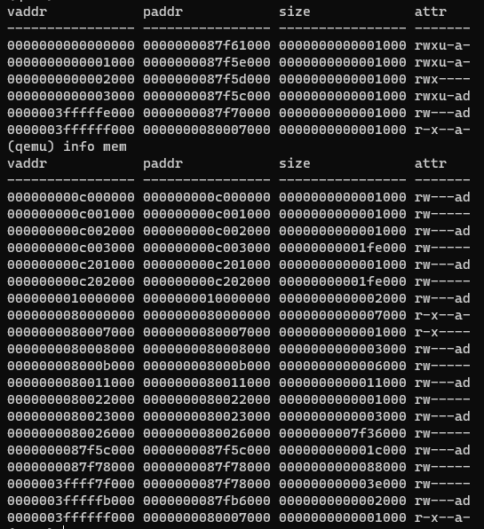

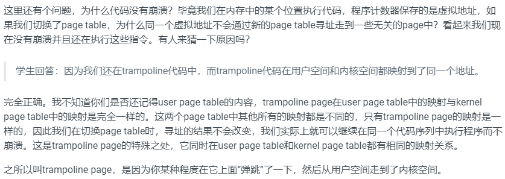

跳转到t0指向的函数 - usertrap()

```assembly
# jump to usertrap(), which does not return
jr t0
```

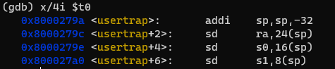


#### usertrap函数（trap.c）

```gdb
tui enable
```

不同类的trap都会来到usertrap()，系统调用、中断、除0, etc。有的trap从用户空间产生，有的从内核空间产生，这两类的处理很不同，usertrap()会存储并恢复硬件状态，并且通过判断trap的类型来进行相应的处理。

1. 修改stvec寄存器的值为kernelvec（kernel-trap-handler）

   ```c
   w_stvec((uint64)kernelvec);
   ```

2. 将用户空间中断点处的pc（存在sepc寄存器中）存到与此进程相关的内存中

   - 防止嵌套发生trap，覆盖sepc则原来的pc丢失

   ```c
   p->trapframe->epc = r_sepc();
   ```

3. 判断trap类型，并进行相应处理（以系统调用为例）

   ```c
   if(r_scause() == 8){
       // system call
       if(p->killed) exit(-1);
       // sepc points to the ecall instruction,
       // but we want to return to the next instruction.
       p->trapframe->epc += 4;
       // an interrupt will change sstatus &c registers,
       // so don't enable until done with those registers.
       // XV6会在处理系统调用的时候开中断，这样中断可以更快的服务，有些系统调用需要许多时间处理。中断总是会被RISC-V的trap硬件关闭，所以在这个时间点，我们需要显式的打开中断。
       intr_on();
       syscall();
     } else if((which_dev = devintr()) != 0){
       // ok
     } else {
       printf("usertrap(): unexpected scause %p pid=%d\n", r_scause(), p->pid);
       printf("            sepc=%p stval=%p\n", r_sepc(), r_stval());
       p->killed = 1;
     }
   ```

   进入syscall()执行；根据系统调用号索引进入sys_write()，从trapframe中获取保存的参数，完成系统调用实际功能；返回syscall()，返回值存入trapframe->a0中（所有系统调用都有一个返回值）。

   ```c
   void
   syscall(void)
   {
     int num;
     struct proc *p = myproc();
   
     num = p->trapframe->a7;
     if(num > 0 && num < NELEM(syscalls) && syscalls[num]) {
       p->trapframe->a0 = syscalls[num]();
     } else {
       printf("%d %s: unknown sys call %d\n",
               p->pid, p->name, num);
       p->trapframe->a0 = -1;
     }
   }
   ```

   ```c
   uint64
   sys_write(void)
   {
     struct file *f;
     int n;
     uint64 p;
   
     if(argfd(0, 0, &f) < 0 || argint(2, &n) < 0 || argaddr(1, &p) < 0)
       return -1;
   
     return filewrite(f, p, n);
   }
   ```

#### usertrapret函数（trap.c）

返回到用户空间之前内核要做的工作

1. 设置stvec寄存器为user-trap-handler，设置之前要关中断（此时在内核态）

   ```c
   // we're about to switch the destination of traps from
   // kerneltrap() to usertrap(), so turn off interrupts until
   // we're back in user space, where usertrap() is correct.
   intr_off();
   
   // send syscalls, interrupts, and exceptions to trampoline.S
   w_stvec(TRAMPOLINE + (uservec - trampoline));
   ```

2. 将内核页表、当前进程的内核栈、usertrap函数的指针、tp寄存器中当前的CPU核编号填入trapframe

   ```c
   // set up trapframe values that uservec will need when
   // the process next re-enters the kernel.
   p->trapframe->kernel_satp = r_satp();         // kernel page table
   p->trapframe->kernel_sp = p->kstack + PGSIZE; // process's kernel stack
   p->trapframe->kernel_trap = (uint64)usertrap;
   p->trapframe->kernel_hartid = r_tp();         // hartid for cpuid()
   ```

3. 设置SSTATUS寄存器（控制寄存器）

   - SPP位：执行sret返回user mode(0)还是supervisor mode(1)
   - SPIE位：执行完sret后是否开中断

   ```c
   // set S Previous Privilege mode to User.
   unsigned long x = r_sstatus();
   x &= ~SSTATUS_SPP; // clear SPP to 0 for user mode
   x |= SSTATUS_SPIE; // enable interrupts in user mode
   w_sstatus(x);
   ```

4. 写回pc值

   ```c
   // set S Exception Program Counter to the saved user pc.
   w_sepc(p->trapframe->epc);
   ```

5. 准备好user page table
   - 会在汇编代码trampoline中完成page table的切换，并且也只能在trampoline中完成切换，因为只有trampoline中代码是同时在用户和内核空间中映射。

6. 跳转到trampoline中的userret函数处

   ```c
   // jump to trampoline.S at the top of memory, which 
   // switches to the user page table, restores user registers,
   // and switches to user mode with sret.
   uint64 fn = TRAMPOLINE + (userret - trampoline);
   ((void (*)(uint64,uint64))fn)(TRAPFRAME, satp);
   ```

   

#### userret函数（trampoline.S）

1. 切换为user page table

2. 将SSCRATCH寄存器恢复成保存好的用户的a0寄存器

   在这里a0是trapframe的地址，因为C代码usertrapret函数中将trapframe地址作为第一个参数传递过来了。112是a0寄存器在trapframe中的偏移量。

   先将这个地址里的数值保存在t0寄存器中，之后再将t0寄存器的数值保存在SSCRATCH寄存器中。

   ```assembly
   # put the saved user a0 in sscratch, so we
   # can swap it with our a0 (TRAPFRAME) in the last step.
   ld t0, 112(a0)
   csrw sscratch, t0
   ```

3. 将之前保存在trapframe中的寄存器的值加载到对应的各个寄存器中

   注意trapframe中的a0寄存器是执行系统调用的返回值

4. 交换a0与sscratch的值

   a0持有的是系统调用的返回值，SSCRATCH持有的是trapframe的地址。

5. 执行内核态的最后一条指令：sret

#### sret指令

- 切换为user mode
- sepc寄存器的数值被拷贝到pc中
- 开中断


## 4.3 Code: Calling system calls

how the user call makes its way to the exec system call’s implementation in the kernel？

1. `initcode.S` invoking the `exec` system call (user/initcode.S)

   ```assembly
   start:
           la a0, init
           la a1, argv
           li a7, SYS_exec
           ecall
   ```

   - 系统调用的参数首先存在寄存器中（像其他函数调用参数一样）

   - 系统调用号被存入寄存器`a7`中（syscall.h中定义系统调用号）

   - `ecall`指令调用

2. 函数`syscall` (kernel/syscall.c:133) 在`a7`中取回系统调用号，索引相应的系统调用函数并调用；返回值存在trapframe->a0中。

   - syscalls[]为函数指针数组

   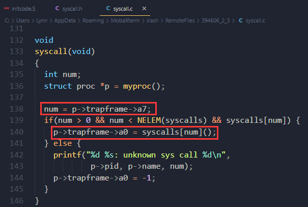

   - `syscalls[7]()`->`sys_exec` (kernel/sysfile.c) ，获取系统调用参数，进入`exec`函数实现。

   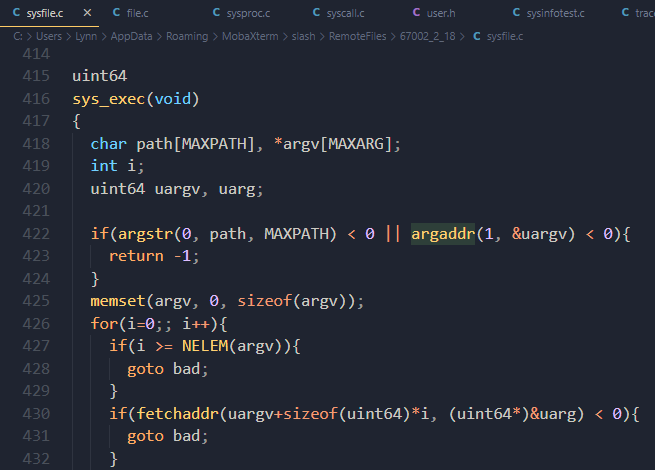


## 4.4 Code: System call arguments

user code calls system call wrapper functions, the arguments are initially in registers, and trap code saves them to the current process's trap frame.

The functions `argint`, `argaddr`, and `argfd` retrieve the n ’th system call argument from the trap frame as an integer, pointer, or a file descriptor. They all call `argraw` to retrieve the appropriate saved user register (kernel/syscall.c:35).

- pass pointers as arguments 2 challenges

......未完待续