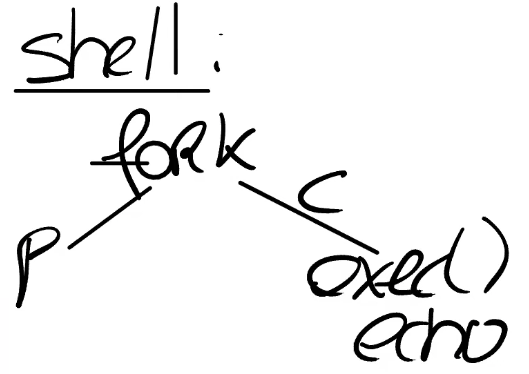

# chapter 5: Page Fault

## 1- Page Fault Basics

page fault：是一种trap（类似系统调用）

通过page fault可以实现的一系列虚拟内存功能：

- lazy allocation
- copy-on-write fork
- demand paging
- memory mapped file


虚拟内存两大优点：

- Isolation（隔离性）
  - 不同应用程序地址空间的隔离；用户空间和内核空间的隔离
  
- level of indirection（抽象）

  已经学过的一些栗子：

  - trampoline page (同一个物理地址映射多个虚拟地址)；guard page (实际没有映射到任何物理内存)
  - 处理器和所有的指令都可以使用虚拟地址，而内核会定义从虚拟地址到物理地址的映射关系。这一层抽象是我们这节课要讨论的许多有趣功能的基础。


到目前为止，我们介绍的内存地址映射相对来说比较静态。不管是user page table还是kernel page table，都是在最开始的时候设置好，之后就不会再做任何变动。

**通过page fault，内核可以更新页表，使地址映射关系变得动态**

核心思想：当发生page fault时再更换页表。xv6当发生page fault时会panic杀掉进程，但实际上有些情况不需要panic（常保守的处理方式）。

**Combination of page faults and updating page table is powerful!**


发生page fault时，内核需要什么样的信息才能够响应page fault：

- **引起page fault的虚拟地址（触发page fault的源）**
  - 当出现page fault的时候，XV6内核会打印出错的虚拟地址，并且这个地址会被保存在**STVAL寄存器**中。
- **引起page fault的原因类型**
  - 对不同场景的page fault有不同的响应；**SCAUSE**保存了trap的原因
  - 3种page fault：	
    - load page faults (when a load instruction cannot translate its virtual address)
    - store page faults (when a store instruction cannot translate its virtual address) 
    - instruction page faults (when the address for an instruction doesn’t translate)


- **触发page fault的指令和mode**
  - SEPC寄存器，同时保存在trapframe->epc
    - 关心触发page fault时的pc是因为，在page fault handler中我们或许想要修复page table，并重新执行对应的指令。
  - U/K mode：implicit in usertrap/kerneltrap

## 2- Lazy page allocation

内存分配

- sbrk（XV6提供的系统调用，使得应用程序能扩大自己的heap）
  - 当一个应用程序启动的时候，sbrk指向的是heap的最底端，同时也是stack的最顶端。这个位置通过代表进程的数据结构中的sz字段表示，以p->sz表示。
  - 当sbrk实际发生或者被调用的时候，内核会分配一些物理内存，并将这些内存映射到用户应用程序的地址空间，然后将内存内容初始化为0，再返回sbrk系统调用。


sbrk默认实现是**eager allocation**：一旦调用了sbrk，内核会立即分配应用程序所需要的物理内存。但是实际上，对于应用程序来说很难预测自己需要多少内存，其倾向于申请多于自己所需要的内存，导致进程的内存消耗会增加许多，但是有部分内存永远也不会被应用程序所使用到。

**lazy allocation**：sbrk系统调基本上不做任何事情，唯一需要做的事情就是将p->sz增加n，其中n是需要新分配的内存page数量（or字节数）。但是内核此时并不会分配任何物理内存。之后在某个时间点，应用程序使用到了新申请的那部分内存，这时会触发page fault。

当产生一个page fault，相应的虚拟地址小于当前*p->sz*，同时大于stack，则这是一个来自于heap的地址，但是内核还没有分配任何物理内存。处理：在page fault handler中，通过kalloc函数分配一个内存page；初始化这个page内容为0；将这个内存page映射到user page table中；最后重新执行指令。

修改sys_sbrk()

```c
uint64
sys_sbrk(void)
{
  int addr;
  int n;

  if(argint(0, &n) < 0)
    return -1;
  addr = myproc()->sz;
  // if(growproc(n) < 0)   // eager allocation
  //   return -1;
  myproc()->sz = myproc()->sz + n;   // lazy allocation
  return addr;
}
```


page fault信息：

- SCAUSE寄存器：15（store page fault）
- pid为3（应该为shell的pid）
- sepc寄存器：0x12ac
- 出错的va（stval寄存器的值）：0x4008
  - 一个页大小为0x1000，而XV5中shell通常有4个页（包含了text和data），出错的va明显在第5个页中

查看shell的汇编代码sh.asm，搜索sepc对应的值，可以看到page fault出现在malloc函数中，此处在向未分配的内存中写数据。


lazy allocation中的page fault处理：

在trap处理函数usertrap()中根据SCAUSE的不同值完成不同操作（实验内容）

## 3- Zero Fill On Demand

用户程序的地址空间，存在text区域，data区域，同时还有一个BSS区域（注，BSS区域包含了未被初始化或者初始化为0的全局或者静态变量）。

当编译器在生成二进制文件时，编译器会填入这三个区域。text区域是程序的指令，data区域存放的是初始化了的全局变量，BSS包含了未被初始化或者初始化为0的全局变量。

之所以这些变量要单独列出来，是因为例如你在C语言中定义了一个大的矩阵作为全局变量，它的元素初始值都是0，为什么要为这个矩阵分配内存呢？其实只需要记住这个矩阵的内容是0就行。

在一个正常的操作系统中，如果执行exec，exec会申请地址空间，里面会存放text和data。因为BSS里面保存了未被初始化的全局变量，这里或许有许多许多个page，但是所有的page内容都为0。

通常可以调优的地方是，我有如此多的内容全是0的page，在物理内存中，我只需要分配一个page，这个page的内容全是0。然后将所有虚拟地址空间的全0的page都map到这一个物理page上。这样至少在程序启动的时候能节省大量的物理内存分配。


- mapping需要非常的小心，不能允许对于这个page执行写操作
- 应用程序尝试写BSS中的一个page时，比如说需要更改一两个变量的值，我们会得到page fault；此时需要创建一个新的page，将其内容设置为0，创建映射关系，然后重新执行指令。


好处：

1. 节省了物理内存
2. exec需要做的工作变少了；程序可以启动的更快，这样你可以获得更好的交互体验，因为你只需要分配一个内容全是0的物理page。所有的虚拟page都可以映射到这一个物理page上。


## 4- Copy On Write Fork

当Shell处理指令时，它会通过fork创建一个子进程。fork会创建一个Shell进程的拷贝，所以这时我们有一个父进程（原来的Shell）和一个子进程。Shell的子进程执行的第一件事情就是调用exec运行一些其他程序，比如运行echo。现在的情况是，fork创建了Shell地址空间的一个完整的拷贝，而exec做的第一件事情就是丢弃这个地址空间，取而代之的是一个包含了echo的地址空间。这里看起来有点浪费。



最开始有一个父进程的虚拟地址空间，然后我们有了子进程的虚拟地址空间。在物理内存中，XV6中的Shell通常会有4个page，当调用fork时，基本上就是创建了4个新的page，并将父进程page的内容拷贝到4个新的子进程的page中。


但是之后，一旦调用了exec，我们又会释放这些page，并分配新的page来包含echo相关的内容。所以对于这个特定场景有一个非常有效的优化：当我们创建子进程时，与其创建，分配并拷贝内容到新的物理内存，其实我们可以直接共享父进程的物理内存page。所以这里，我们可以设置子进程的PTE指向父进程对应的物理内存page。

再次要提及的是，我们这里需要非常小心。因为一旦子进程想要修改这些内存的内容，相应的更新应该对父进程不可见，因为我们希望在父进程和子进程之间有强隔离性，所以这里我们需要更加小心一些。为了确保进程间的隔离性，我们可以将这里的父进程和子进程的PTE的标志位都设置成只读的。


在某个时间点，当我们需要更改内存的内容时，我们会得到page fault。因为父进程和子进程都会继续运行，而父进程或者子进程都可能会执行store指令来更新一些全局变量，这时就会触发page fault，因为现在在向一个只读的PTE写数据。

在得到page fault之后，我们需要拷贝相应的物理page。假设现在是子进程在执行store指令，那么我们会分配一个新的物理内存page，然后将page fault相关的物理内存page拷贝到新分配的物理内存page中，并将新分配的物理内存page映射到子进程。这时，新分配的物理内存page只对子进程的地址空间可见，所以我们可以将相应的PTE设置成可读写，并且我们可以重新执行store指令。实际上，对于触发刚刚page fault的物理page，因为现在只对父进程可见，相应的PTE对于父进程也变成可读写的了。


拷贝了一个page，将新的page映射到相应的用户地址空间，并重新执行用户指令。重新执行用户指令是指调用userret函数。


释放问题：对于这里的物理内存page，现在有多个用户进程或者说多个地址空间都指向了相同的物理内存page，需要对于每一个物理内存page的引用进行计数，当我们释放虚拟page时，我们将物理内存page的引用数减1，如果引用数等于0，那么我们就能释放物理内存page。

## 5- Demanding Paging

回到exec，在未修改的XV6中，操作系统会加载程序内存的text，data区域，并且以eager的方式将这些区域加载进page table。

为什么不再等等，直到应用程序实际需要这些指令的时候再加载内存？程序的二进制文件可能非常的巨大，将它全部从磁盘加载到内存中将会是一个代价很高的操作。又或者data区域的大小远大于常见的场景所需要的大小，我们并不一定需要将整个二进制都加载到内存中。

所以对于exec，在虚拟地址空间中为text和data分配好地址段，但是相应的PTE并不对应任何物理内存page（PTE_V设置为0即可）

应用程序是从地址0开始运行。text区域从地址0开始向上增长。位于地址0的指令是会触发第一个page fault的指令，因为还没有真正的加载内存。首先我们可以发现，这些page是on-demand page。我们需要在某个地方记录了这些page对应的程序文件，我们在page fault handler中需要从程序文件中读取page数据，加载到内存中；之后将内存page映射到page table；最后再重新执行指令。

首先我们可以发现，这些page是on-demand page。我们需要在某个地方记录这些page对应的程序文件，我们在page fault handler中需要从程序文件中读取page数据，加载到内存中；之后将内存page映射到page table；最后再重新执行指令。

性能分析：在最坏的情况下，用户程序使用了text和data中的所有内容，那么我们将会在应用程序的每个page都收到一个page fault。但是如果我们幸运的话，用户程序并没有使用所有的text区域或者data区域，那么我们一方面可以节省一些物理内存，另一方面我们可以让exec运行的更快（注，因为不需要为整个程序分配内存）。

内存耗尽问题：

- 一种选择：撤回page。将部分内存page中的内容写回到文件系统再撤回page。一旦你撤回并释放了page，那么你就有了一个新的空闲的page，你可以使用这个刚刚空闲出来的page，分配给刚刚的page fault handler，再重新执行指令。
  - 撤回page原则：Least Recently Used（LRU）；优先选择non-dirty page - Access bit

如果你们再看PTE，我们有RSW位，你们可以发现在bit7，对应的就是Dirty bit。当硬件向一个page写入数据，会设置dirty bit，之后操作系统就可以发现这个page曾经被写入了。类似的，还有一个Access bit，任何时候一个page被读或者被写了，这个Access bit会被设置。

## 6- Memory Mapped Files

核心思想：将完整或者部分文件加载到内存中，这样就可以通过内存地址相关的load或者store指令来操纵文件。

为了支持这个功能，一个现代的操作系统会提供一个叫做mmap的系统调用。


mmap语义：从文件描述符对应的文件的偏移量的位置开始，映射长度为len的内容到虚拟内存地址VA，同时我们需要加上一些保护，比如只读或者读写。

**eager方式的mmap：**

内核会从文件的offset位置开始，将数据拷贝到内存，设置好PTE指向物理内存的位置。之后应用程序就可以使用load或者store指令来修改内存中对应的文件内容。当完成操作之后，会有一个对应的unmap系统调用，参数是虚拟地址（VA），长度（len）。来表明应用程序已经完成了对文件的操作，在unmap时间点，我们需要将dirty block写回到文件中。根据dirty bit的置位，很容易找到哪些block是dirty的。

**lazy方式的mmap：**

不会立即将文件内容拷贝到内存中，而是先记录一下这个PTE属于这个文件描述符。相应的信息通常在VMA结构体中保存，VMA全称是Virtual Memory Area。例如对于文件f，会有一个VMA，在VMA中会记录文件描述符，偏移量等等，这些信息用来表示对应的内存虚拟地址的实际内容在哪，这样当我们得到一个位于VMA地址范围的page fault时，内核可以从磁盘中读数据，并加载到内存中。


