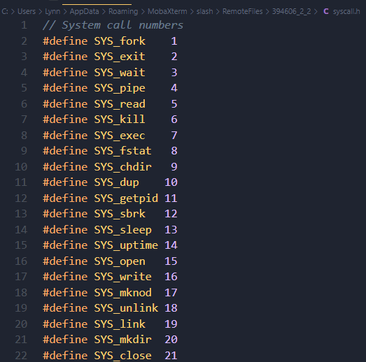
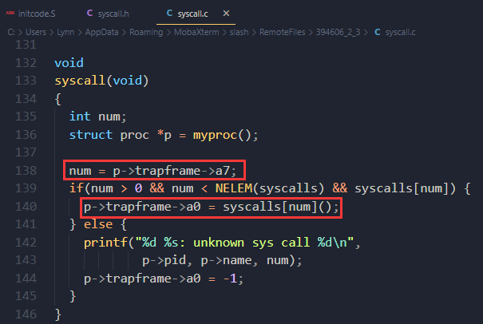
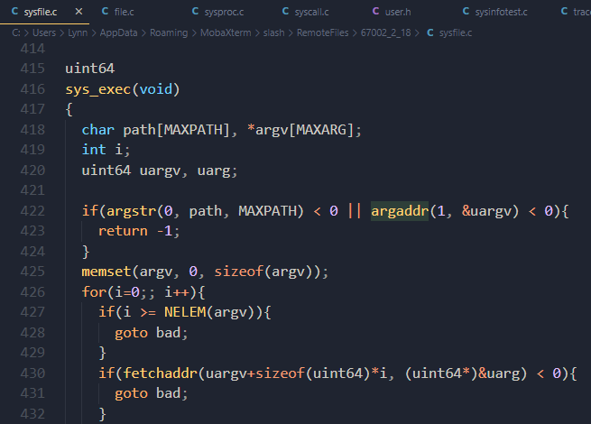
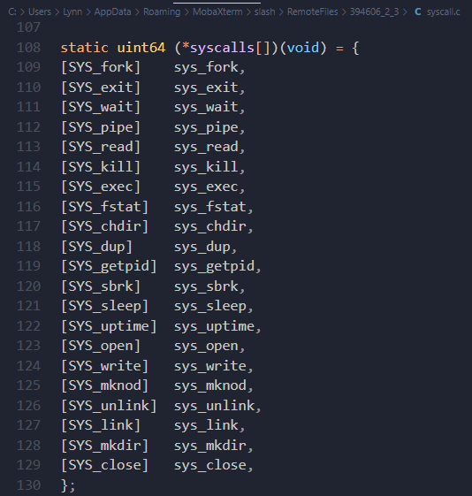

# chapter 4 Traps and system calls

## 4.3 Code: Calling system calls

how the user call makes its way to the exec system call’s implementation in the kernel？

1. `initcode.S` invoking the `exec` system call (user/initcode.S)

   ```assembly
   start:
           la a0, init
           la a1, argv
           li a7, SYS_exec
           ecall
   ```

   - `exec`'s arguments are placed in register`a0` `a1`

   - system call number is placed in register`a7`

     

   - `ecall` instruction

2. `syscall` (kernel/syscall.c:133) retrieves the system call number from the saved a7 in the trapframe and uses it to index into syscalls.

   

   - `syscalls[7]()`->`sys_exec` (kernel/sysfile.c) 进入`exec`函数实现：

     

   - `syscall` records its return value in p->trapframe->a0

   - #`syscalls array` - a table of function pointers
   
     


## 4.4 Code: System call arguments

user code calls system call wrapper functions, the arguments are initially in registers, and trap code saves them to the current process's trap frame.

The functions `argint`, `argaddr`, and `argfd` retrieve the n ’th system call argument from the trap frame as an integer, pointer, or a file descriptor. They all call `argraw` to retrieve the appropriate saved user register (kernel/syscall.c:35).

- pass pointers as arguments 2 challenges

......未完待续